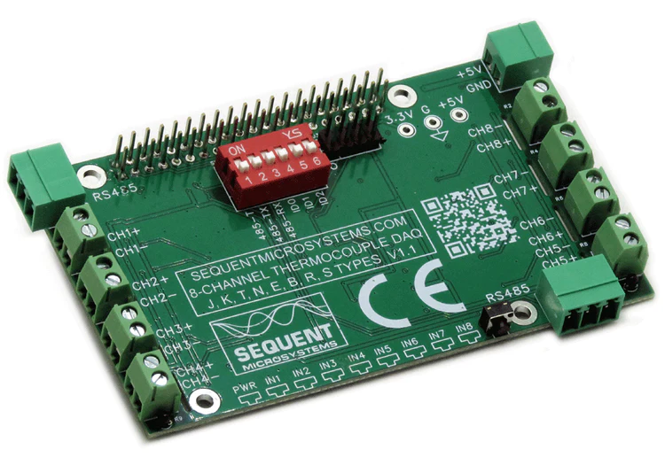

[](https://www.sequentmicrosystems.com)

[]([https://www.sequentmicrosystems.com/products/eight-thermocouples-daq-8-layer-stackable-hat-for-raspberry-pi)]

# smtc-rpi


This is the command to control [ Eight Thermocouples DAQ 8-Layer Stackable Card for Raspberry Pi](https://sequentmicrosystems.com/products/eight-thermocouples-daq-8-layer-stackable-hat-for-raspberry-pi)

Don't forget to enable I2C communication:
```bash
sudo raspi-config
```

## Install

```bash
cd
git clone https://github.com/SequentMicrosystems/smtc-rpi.git
cd smtc-rpi/
sudo make install
```
## Usage
Now you can access all the functions of the card through the command "smtc". Use -h option for help:
```bash
smtc -h
```
## Update
If you clone the repository, any update can be made with the following commands:

```bash
cd
cd smtc-rpi/  
git pull
sudo make install
```  
